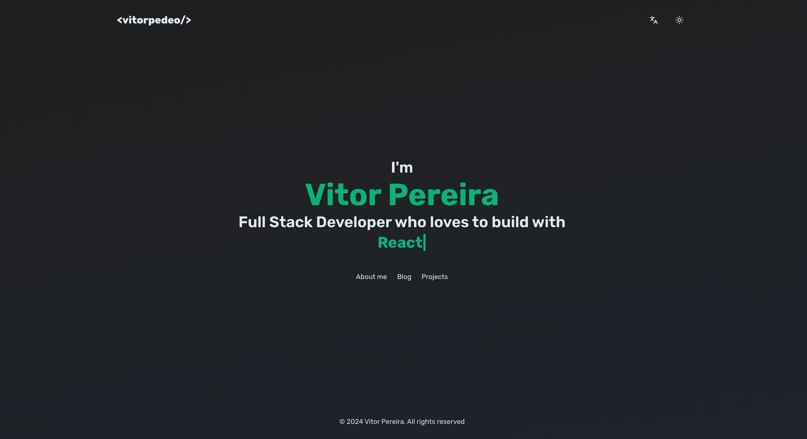

  

  
  
  

<h3 align="center">
  vitorpedeo - Personal Website
</h3>

  My personal website repo

 

## 📗 About this repo

  

This repo contains all the source code of my [Website](https://www.vitorpedeo.dev).

## 🔨 Technologies

I decided to use a CMS in my website. I chose [Contentful](https://www.contentful.com/), a powerful Headless CMS that fitted perfectly in my project.

Besides the CMS, these are the libraries that I think are the most important to my project:

- [Next.js](https://nextjs.org/)
- [Typescript](https://www.typescriptlang.org/)
- [Chakra UI](https://chakra-ui.com/)
- [React Intl](https://formatjs.io/docs/react-intl/)
- [React Markdown](https://remarkjs.github.io/react-markdown/)
- [React Syntax Highlighter](https://react-syntax-highlighter.github.io/react-syntax-highlighter/demo/)

## 🚀 Deploy

My website was deployed to [Vercel](https://vercel.com/).
